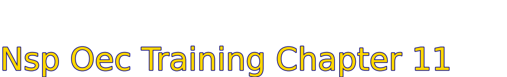
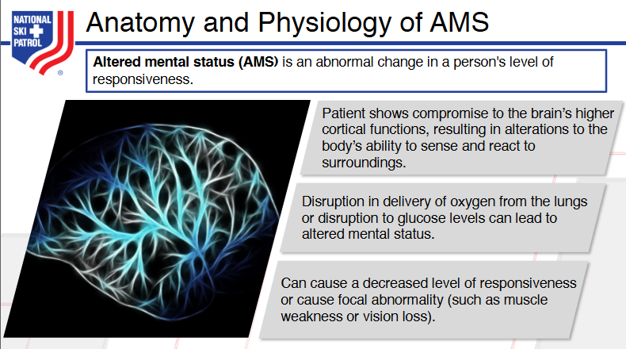
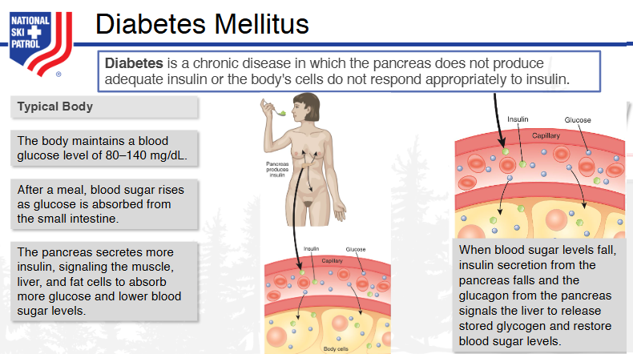
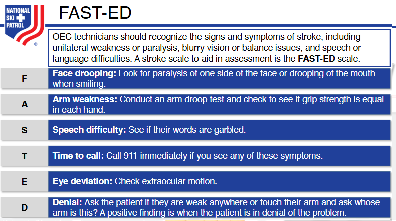
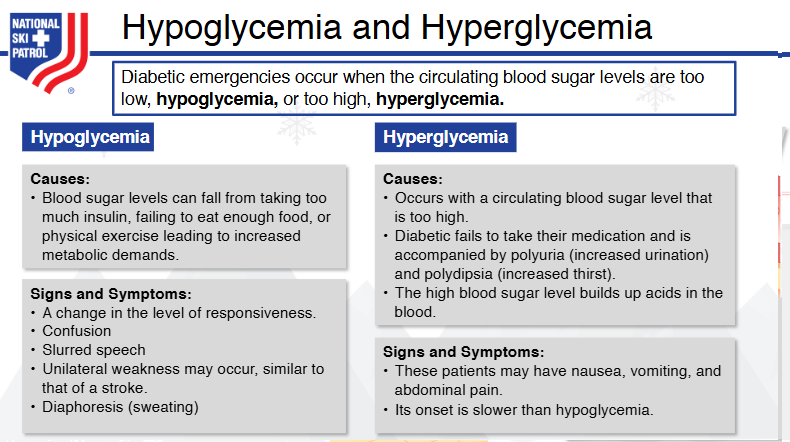
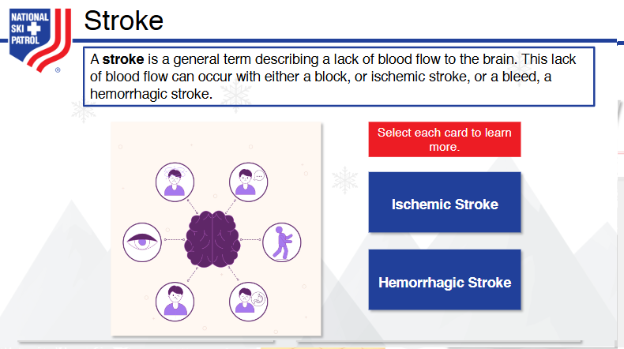
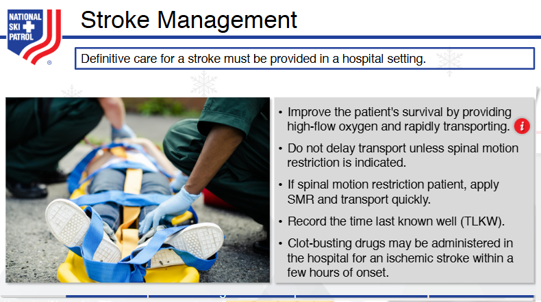
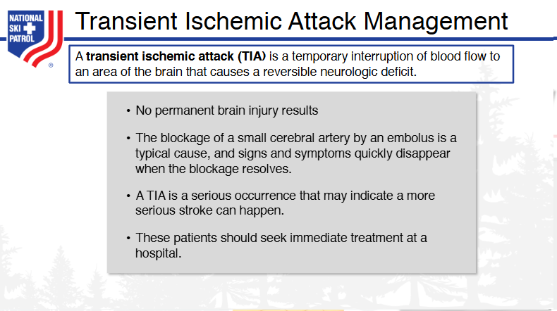

# Nsp Oec Training Chapter 11 - National Ski Patrol - Outdoor Emergency Care chapter 11
Module Objectives
After participating in this module, subsequent skills component, and book reading, you should be able to:

## Chapter 11: Altered Mental Status

1. Define altered mental status.
2. List causes of altered mental status using the mnemonic AEIOU-TIPS.
3. Describe and demonstrate the management of a transient ischemic attack.
4. List the signs and symptoms of focal (partial) seizure, generalized seizure, hypoglycemia, and hyperglycemia.
5. Describe how to assess a patient with altered mental status.
6. Define FAST-ED and how this can be used to identify someone who is having a stroke.
7. Describe and demonstrate the management of the two types of stroke.
8. Demonstrate the treatment of a patient with altered mental status.

## 11.1  Define altered mental status.

**Altered mental status (AMS)** is a broad medical term that refers to a change in a person's cognitive function or consciousness. This can manifest as confusion, disorientation, lethargy, agitation, or unconsciousness. AMS can be caused by various factors, including infections, head injuries, metabolic imbalances, medications, or neurological conditions such as stroke or dementia. Identifying the underlying cause of altered mental status is critical for proper treatment. It is often considered a **medical emergency**, especially if the change in mental status is sudden or severe.

## 11.2  List causes of altered mental status using the mnemonic AEIOU-TIPS.

The mnemonic **AEIOU-TIPS** is commonly used to remember the **causes of altered mental status (AMS)**. Each letter stands for a category of conditions that can lead to AMS:

- **A** – **Alcohol** (or drug intoxication) and **Acidosis**: This includes alcohol intoxication, drug overdose, or metabolic acidosis.
- **E** – **Endocrine, Electrolytes, and Encephalopathy**: Disorders like hypoglycemia, hyperglycemia (diabetic emergencies), electrolyte imbalances (e.g., hyponatremia), or hepatic encephalopathy.
- **I** – **Infection**: Includes infections such as meningitis, encephalitis, sepsis, or urinary tract infections (especially in the elderly).
- **O** – **Overdose** (or oxygen deficiency): Overdose on medications or drugs, or hypoxia (low oxygen levels).
- **U** – **Uremia**: Resulting from kidney failure, leading to toxin buildup in the blood.
- **T** – **Trauma or Tumor**: Head injuries (trauma), concussions, or brain tumors.
- **I** – **Insulin**: Hypoglycemia or hyperglycemia due to insulin imbalances.
- **P** – **Psychosis or Poisoning**: Severe psychiatric conditions or poisoning from toxins or chemicals.
- **S** – **Seizure, Stroke, or Shock**: Postictal states (following seizures), cerebrovascular accidents (strokes), or shock (septic, hypovolemic, etc.).

This mnemonic helps healthcare professionals quickly assess the broad range of possible causes of altered mental status during diagnosis.

## 11.3  Describe and demonstrate the management of a transient ischemic attack.

### **Description of a Transient Ischemic Attack (TIA)**

A **Transient Ischemic Attack (TIA)**, also known as a **mini-stroke**, occurs when there is a temporary reduction of blood flow to the brain, often due to a blood clot. Unlike a full stroke, the blockage in TIA is brief, and the symptoms usually resolve within minutes to hours, without causing permanent brain damage. However, a TIA is a warning sign for a potential future stroke and requires immediate medical attention.

### **Signs and Symptoms of a TIA**
- **Sudden weakness or numbness** in the face, arm, or leg, particularly on one side of the body.
- **Difficulty speaking** or understanding speech (aphasia).
- **Sudden confusion** or trouble thinking.
- **Vision problems** in one or both eyes (e.g., double vision or loss of vision).
- **Dizziness, loss of balance, or coordination**.
- **Severe headache** with no known cause.

The symptoms of TIA are often similar to those of a full stroke but are temporary, usually lasting less than 24 hours, and fully resolve without causing permanent damage.

### **Management of a Transient Ischemic Attack**

#### **Immediate Actions**
1. **Call Emergency Services**:
   - A TIA is a medical emergency. Even if symptoms resolve quickly, **immediate medical attention is critical** to reduce the risk of a full-blown stroke.
   - Call **911** or the emergency services in your area for urgent medical evaluation.

2. **Assess ABCs (Airway, Breathing, Circulation)**:
   - Ensure the patient’s **airway** is clear, they are **breathing**, and their **circulation** is stable.
   - If there is any sign of compromise in breathing or consciousness, begin **basic life support** (BLS) until help arrives.

3. **Monitor Symptoms**:
   - Keep track of the patient's symptoms and how long they last.
   - If possible, use the **FAST acronym**:
     - **F**ace: Ask the person to smile and check for facial drooping.
     - **A**rms: Ask the person to raise both arms and check for weakness.
     - **S**peech: Ask the person to repeat a simple sentence and listen for slurred speech.
     - **T**ime: Time is critical—get medical help immediately.

#### **Medical Evaluation and Treatment**
Once the patient reaches a medical facility, the healthcare team will:

1. **Perform Imaging Tests**:
   - **CT or MRI scan** to determine if there is any brain damage or evidence of a stroke.
   - **Carotid ultrasound** or **echocardiogram** may be done to check for blockages or clots in blood vessels.

2. **Administer Medications**:
   - **Antiplatelet drugs** (e.g., aspirin, clopidogrel) or **anticoagulants** (e.g., warfarin, dabigatran) to reduce the risk of clot formation.
   - **Statins** may be prescribed to lower cholesterol and reduce the risk of future events.
   - **Blood pressure management**: If high blood pressure is a factor, medication may be given to control it.

3. **Lifestyle Modifications**:
   - The patient will likely be advised to adopt a heart-healthy lifestyle:
     - **Quit smoking**.
     - **Maintain a healthy diet** low in salt, fat, and cholesterol.
     - **Exercise regularly**.
     - **Manage chronic conditions** like diabetes and hypertension.

4. **Surgical Interventions (if necessary)**:
   - For some patients, **carotid endarterectomy** (surgical removal of plaque from the carotid artery) or **angioplasty** with stenting may be required to open narrowed arteries.

#### **Follow-Up Care**
- **Cardiovascular and Stroke Prevention**: Ongoing medical treatment to manage risk factors such as **high blood pressure**, **high cholesterol**, **diabetes**, and **atrial fibrillation** is essential to prevent future strokes.
- **Lifestyle Changes**: The patient will be instructed to adhere strictly to lifestyle changes to reduce the likelihood of a stroke.
- **Regular Monitoring**: Patients will need regular follow-up with their healthcare provider to monitor their condition and adjust treatment as necessary.

### **Demonstration of Management: Step-by-Step**
1. **On Scene (Pre-Hospital Care)**:
   - Recognize signs of TIA (FAST).
   - Ensure ABCs are stable and place the patient in a comfortable position.
   - Call emergency services.

2. **Hospital Treatment**:
   - Medical professionals will stabilize the patient and perform **imaging tests** to assess the risk of stroke.
   - **Medication** (antiplatelets, anticoagulants) will be started to prevent clot formation.
   - Address underlying risk factors (e.g., high blood pressure, cholesterol).

3. **Post-Hospital**:
   - **Discharge plan** includes medication adherence, lifestyle changes, and follow-up appointments.
   - The patient will be monitored for stroke prevention strategies.

### **Summary**
A TIA is an urgent medical condition, and timely intervention can prevent a full stroke. Early recognition and immediate medical care, including imaging, medication, and lifestyle modifications, play crucial roles in managing a transient ischemic attack.

## 11.4  List the signs and symptoms of focal (partial) seizure, generalized seizure, hypoglycemia, and hyperglycemia.

### **Signs and Symptoms of Focal (Partial) Seizures**

**Focal seizures** (also known as **partial seizures**) affect only one area of the brain and may present in different ways depending on the area involved. They are often categorized into **focal aware** and **focal impaired awareness** seizures.

#### **Focal Aware Seizure Symptoms**:
- **Consciousness remains intact** during the seizure.
- **Unusual sensations**: This could include tingling, dizziness, or flashing lights.
- **Uncontrolled movements**: Jerking movements of one part of the body, such as the hand, arm, or leg (known as motor seizures).
- **Emotional changes**: Sudden intense feelings like fear, anger, or joy.
- **Sensory symptoms**: Changes in the senses, such as strange tastes, smells, or sounds.

#### **Focal Impaired Awareness Seizure Symptoms**:
- **Altered consciousness**: The person may appear confused or dazed.
- **Automatisms**: Repetitive behaviors, such as lip-smacking, chewing, or walking in circles.
- **Memory loss**: The person may not recall the seizure or what happened during it.

---

### **Signs and Symptoms of Generalized Seizures**

**Generalized seizures** affect both sides of the brain and typically result in loss of consciousness. There are various types of generalized seizures:

#### **Tonic-Clonic (Grand Mal) Seizure Symptoms**:
- **Loss of consciousness** and **falling to the ground**.
- **Tonic phase**: Stiffening of muscles.
- **Clonic phase**: Jerking or twitching movements of the arms and legs.
- **Postictal phase**: Confusion, fatigue, and drowsiness following the seizure.

#### **Absence (Petit Mal) Seizure Symptoms**:
- **Brief loss of awareness**: The person may stare blankly into space.
- **Subtle movements**: Such as blinking or lip-smacking.
- **No memory of the event**: Typically lasts for a few seconds.

#### **Myoclonic Seizure Symptoms**:
- **Sudden, brief jerks** or twitches of muscles, often in the arms and legs.

#### **Atonic Seizure Symptoms**:
- **Sudden loss of muscle tone**, causing the person to collapse or drop things.

---

### **Signs and Symptoms of Hypoglycemia**

**Hypoglycemia** (low blood sugar) occurs when blood glucose levels drop below normal, usually below **70 mg/dL**.

#### **Early Signs**:
- **Shakiness or tremors**.
- **Sweating**.
- **Hunger**.
- **Dizziness or light-headedness**.
- **Irritability or mood changes**.
  
#### **Severe Signs**:
- **Confusion or disorientation**.
- **Difficulty speaking** or slurred speech.
- **Blurred vision**.
- **Seizures**.
- **Loss of consciousness** (if left untreated).

---

### **Signs and Symptoms of Hyperglycemia**

**Hyperglycemia** (high blood sugar) occurs when blood glucose levels rise above **180 mg/dL**. It often affects people with diabetes.

#### **Early Signs**:
- **Increased thirst** (polydipsia).
- **Frequent urination** (polyuria).
- **Blurred vision**.
- **Fatigue** or drowsiness.
- **Dry mouth**.

#### **Severe Signs** (if left untreated):
- **Nausea and vomiting**.
- **Shortness of breath**.
- **Fruity-smelling breath** (due to ketones).
- **Abdominal pain**.
- **Confusion** or altered consciousness, which could progress to **diabetic ketoacidosis (DKA)** or **hyperosmolar hyperglycemic state (HHS)** in severe cases.

---

These symptoms are key indicators that help in differentiating between various medical emergencies and understanding the underlying conditions. Immediate medical attention is crucial, especially in severe cases.

## 11.5  Describe how to assess a patient with altered mental status.

Assessing a patient with **altered mental status (AMS)** involves a systematic evaluation to identify the underlying cause. AMS can be caused by various conditions, from neurological events like strokes to metabolic disturbances like hypoglycemia. The assessment requires a detailed history, physical examination, and sometimes diagnostic tests.

### **Step-by-Step Assessment of Altered Mental Status**

#### **1. Initial Survey (Primary Assessment)**
- **Check for ABCs**: Ensure that the patient’s **Airway**, **Breathing**, and **Circulation** are stable. If the patient’s airway is compromised, take immediate action to secure it.
- **Level of Consciousness**: Use the **AVPU scale** (Alert, Verbal, Painful, Unresponsive) to quickly assess the patient’s consciousness level.
- **Assess Safety**: Ensure that the environment is safe for both the patient and healthcare provider, especially if the patient is combative or disoriented.

#### **2. Detailed History (SAMPLE)**

- **S**: **Signs and Symptoms**: Ask what symptoms preceded the change in mental status.
- **A**: **Allergies**: Ask about known allergies, which could provide clues about medication or toxin reactions.
- **M**: **Medications**: Review the patient’s medications, as AMS may result from drug interactions, overdose, or missed doses.
- **P**: **Past Medical History**: Look for a history of conditions like diabetes, seizures, dementia, or psychiatric disorders.
- **L**: **Last Oral Intake**: Knowing the patient’s last meal or fluid intake can help identify dehydration, hypoglycemia, or intoxication.
- **E**: **Events Leading Up**: Understand what events preceded the AMS—trauma, substance use, stress, or illness.

#### **3. Neurological Examination**

- **Glasgow Coma Scale (GCS)**: This scale assesses **eye opening**, **verbal response**, and **motor response** to quantify the level of consciousness. The total score ranges from 3 (deep unconsciousness) to 15 (fully alert).
  
- **Pupil Check (PERRL)**: Assess the **Pupils** for **Equal**, **Round**, **Reactive to Light** to identify possible neurological causes (e.g., stroke, brain injury).
  
- **Cranial Nerve Examination**: Check cranial nerves, especially if the patient has focal neurological symptoms (e.g., facial droop, difficulty speaking).

- **Motor and Sensory Function**: Check for strength, coordination, and sensation. Focal weakness or sensory loss may suggest stroke or a brain lesion.

#### **4. Physical Examination**
- **Head-to-Toe Assessment**: Look for signs of trauma, infection, or drug use. Examine the skin for signs of **cyanosis**, **needle marks**, or **rashes**.
- **Vital Signs**: Assess **blood pressure**, **heart rate**, **respiratory rate**, **temperature**, and **oxygen saturation**.
  - Hypotension, tachycardia, or abnormal respiratory patterns can provide clues to metabolic or cardiovascular causes of AMS.
  - A **fever** may indicate an infection, while **hypothermia** may point to metabolic or environmental causes.
  
#### **5. Diagnostic Testing**
- **Blood Glucose Levels**: Check for **hypoglycemia** or **hyperglycemia**. A rapid glucose check should be performed to rule out a diabetic emergency.
  
- **Electrolytes and Metabolic Panel**: Assess for **electrolyte imbalances**, **renal function**, or **liver function** that may be contributing to AMS.
  
- **Toxicology Screen**: If drug overdose or poisoning is suspected, a **tox screen** can identify substances in the blood or urine.
  
- **CT Scan or MRI**: For patients with suspected stroke, head injury, or brain tumor, imaging studies are necessary to visualize the brain and rule out structural abnormalities.

- **Lumbar Puncture**: If there is suspicion of **meningitis** or **encephalitis**, a lumbar puncture may be required to analyze cerebrospinal fluid.

#### **6. Rapid Intervention**
- **Oxygen**: Administer oxygen if the patient is hypoxic (low oxygen levels).
- **Glucose**: For hypoglycemia, administer glucose (oral or IV).
- **Naloxone**: If opioid overdose is suspected, administer **naloxone**.
- **Thiamine**: For suspected **Wernicke's encephalopathy**, especially in alcoholics, give **IV thiamine** before glucose.
- **Seizure Management**: Administer anticonvulsants for ongoing seizures.

#### **7. Ongoing Monitoring**
- Continuously monitor the patient’s **vital signs**, **level of consciousness**, and **neurological status**. Reassess frequently, especially if the patient’s condition changes.

### **Conclusion**
Evaluating a patient with altered mental status requires a structured approach that includes primary assessments for immediate life-threatening conditions, detailed history-taking, and a full physical and neurological examination. This approach allows for the identification of the underlying cause and ensures timely treatment, which is crucial for improving outcomes.

## 11.6  Define FAST-ED and how this can be used to identify someone who is having a stroke.

**FAST-ED** is an acronym used to assess and identify **large vessel occlusion (LVO) strokes**, which are a type of ischemic stroke where a large artery in the brain becomes blocked. This quick assessment tool builds upon the standard **FAST** method (Face, Arms, Speech, Time) and adds additional components to evaluate stroke severity and the potential for a large vessel occlusion, which requires urgent intervention.

### **FAST-ED Breakdown**:
1. **F - Face drooping**: Ask the person to smile or show their teeth. Look for asymmetry or drooping on one side of the face.
2. **A - Arm weakness**: Ask the person to raise both arms. Look for one arm drifting downward or weakness in one arm.
3. **S - Speech difficulty**: Ask the person to repeat a simple sentence. Listen for slurred speech, trouble speaking, or difficulty understanding.
4. **T - Time to call emergency services**: If any of the above signs are present, it is critical to call emergency services immediately. Time is essential in stroke treatment.

### **ED - Additional Components for Large Vessel Occlusion**:
- **E - Eye deviation**: Check for involuntary or forced gaze to one side, which can indicate a stroke in the brain's large vessels.
- **D - Denial/Neglect**: Assess for neglect of one side of the body or denial of weakness in an arm or leg. This can be tested by asking the person to focus on both sides of their body simultaneously, or by checking their awareness of their surroundings.

### **How FAST-ED Helps Identify Strokes**
The **FAST-ED score** is a more sensitive tool for detecting strokes caused by large vessel occlusions, which are often more severe and require advanced treatments like **thrombectomy**. Healthcare providers, paramedics, and emergency responders can use FAST-ED in the field or upon initial contact with the patient to assess whether the patient might benefit from immediate specialized stroke care, such as transfer to a comprehensive stroke center. 

Each symptom (Face drooping, Arm weakness, Speech difficulty, Eye deviation, Denial/Neglect) adds to the FAST-ED score, helping to predict the severity and type of stroke. A higher score indicates a greater likelihood of a large vessel occlusion, which typically requires urgent endovascular treatment.

By quickly identifying these signs, **FAST-ED** can lead to more efficient triage and timely treatment, improving the chances of recovery and reducing the risk of long-term disability following a stroke.

## 11.7  Describe and demonstrate the management of the two types of stroke.

Stroke management differs based on the **type of stroke**: **ischemic stroke**, which is caused by a blockage in a blood vessel supplying the brain, and **hemorrhagic stroke**, which results from bleeding in or around the brain. Each type of stroke requires specific treatment to minimize damage to the brain and improve recovery outcomes. Below is a detailed breakdown of how each type is managed.

---

### **1. Ischemic Stroke**

**Description**: An ischemic stroke occurs when a blood clot blocks a blood vessel in the brain, cutting off blood supply to a region of the brain. This type accounts for about **85%** of all strokes.

#### **Management of Ischemic Stroke**

##### **A. Immediate Actions (Emergency Management)**:
1. **Call Emergency Services**:
   - If a stroke is suspected, call **911** immediately. Early intervention is critical.

2. **Assess the Patient Using FAST**:
   - Use the **FAST** acronym to quickly assess the patient's condition (Face drooping, Arm weakness, Speech difficulty, Time to call emergency services).

3. **Hospital Care**:
   - **tPA (Tissue Plasminogen Activator)**: Administered intravenously if the patient arrives within **4.5 hours** of symptom onset. **tPA** helps dissolve the blood clot and restore blood flow. Not all patients are eligible for tPA, particularly if there are risks of bleeding or recent surgery.
   - **Mechanical Thrombectomy**: If the stroke is caused by a large vessel occlusion (LVO), a **thrombectomy** may be performed, usually within **6 to 24 hours** of symptom onset. This procedure involves physically removing the blood clot using a catheter inserted through an artery.

##### **B. Ongoing Care and Prevention**:
1. **Antiplatelet Therapy**:
   - Patients are typically prescribed **antiplatelet medications** (e.g., aspirin, clopidogrel) to prevent further clot formation.
   
2. **Blood Pressure Management**:
   - **Hypertension control** is crucial in preventing recurrent strokes. Medication is often prescribed to manage high blood pressure.

3. **Statins**:
   - **Statins** may be given to lower cholesterol levels, particularly if the stroke is linked to atherosclerosis (plaque buildup in the arteries).

4. **Lifestyle Modifications**:
   - Encouraging heart-healthy habits, such as quitting smoking, regular exercise, a balanced diet, and managing diabetes.

##### **Example Demonstration**:
- A patient presents with slurred speech and arm weakness. They are rushed to the emergency department, where a **CT scan** confirms ischemic stroke. The patient arrives within the 3-hour window and is eligible for **tPA**, which is administered. If the clot is in a larger artery and cannot be dissolved by tPA, a **thrombectomy** is performed to remove the clot directly, restoring blood flow to the brain.

---

### **2. Hemorrhagic Stroke**

**Description**: A hemorrhagic stroke occurs when a blood vessel in the brain bursts, causing bleeding into or around the brain. This type accounts for about **15%** of all strokes but tends to be more fatal.

#### **Management of Hemorrhagic Stroke**

##### **A. Immediate Actions (Emergency Management)**:
1. **Call Emergency Services**:
   - As with ischemic strokes, time is critical, and emergency services should be called immediately.

2. **Initial Assessment and Imaging**:
   - A **CT scan** or **MRI** is used to confirm the presence of bleeding and the location of the hemorrhage.

3. **Control of Bleeding**:
   - **Stop anticoagulants or antiplatelets**: If the patient is on blood thinners, these are discontinued or reversed (e.g., vitamin K for warfarin patients).
   - **Medications**: Administer medications to lower **intracranial pressure (ICP)** and **blood pressure** (e.g., mannitol or hypertonic saline) to reduce the risk of further bleeding.

##### **B. Surgical Intervention**:
1. **Craniotomy**:
   - In some cases, the patient may require a **craniotomy**, a surgical procedure to relieve pressure in the brain by removing a section of the skull to access and repair the bleeding vessel or remove a clot.
   
2. **Aneurysm Clipping or Coiling**:
   - If the hemorrhage is due to an aneurysm, **surgical clipping** or **endovascular coiling** may be performed to prevent further bleeding.

##### **C. Ongoing Care and Monitoring**:
1. **Intensive Monitoring**:
   - Patients are often monitored in an **ICU** to manage intracranial pressure and prevent further complications.

2. **Rehabilitation**:
   - **Physical, occupational, and speech therapy** are crucial parts of recovery for patients with motor, cognitive, or speech deficits following a hemorrhagic stroke.

##### **Example Demonstration**:
- A patient is brought to the hospital with sudden severe headache, nausea, and vomiting. A **CT scan** confirms a **hemorrhagic stroke**. The patient is given medications to lower blood pressure and reduce brain swelling. If an aneurysm is identified, **endovascular coiling** is performed to prevent further bleeding. The patient is closely monitored in the ICU and later begins rehabilitation therapy to aid recovery.

---

### **Key Differences in Management**
- **Ischemic Stroke**: Focuses on **restoring blood flow** through clot-busting medications (tPA) or mechanical thrombectomy.
- **Hemorrhagic Stroke**: Focuses on **controlling the bleeding** and reducing intracranial pressure, sometimes involving surgical intervention.

Both types of stroke require **urgent medical intervention**, but the treatment strategies differ significantly depending on whether the stroke is ischemic or hemorrhagic. Early diagnosis through imaging, coupled with timely treatment, can significantly improve patient outcomes.

## 11.8  Demonstrate the treatment of a patient with altered mental status.

The treatment of a patient with **altered mental status (AMS)** involves a systematic approach to ensure patient safety, identify the underlying cause, and provide timely medical intervention. Here is a step-by-step demonstration of how to treat a patient with AMS:

### **1. Initial Assessment and Stabilization (Primary Survey)**
- **Ensure Airway, Breathing, and Circulation (ABCs):**  
  - **Airway:** Ensure the patient has a patent airway. If the patient is unresponsive or showing signs of a compromised airway, it may be necessary to insert an airway adjunct (e.g., nasopharyngeal or oropharyngeal airway) or initiate intubation.
  - **Breathing:** Check for adequate ventilation. Administer supplemental oxygen if hypoxia is suspected.
  - **Circulation:** Check pulse and blood pressure. If the patient is in shock (e.g., due to sepsis or hypovolemia), administer intravenous fluids or start resuscitation as necessary.

- **Assess Level of Consciousness:**  
  - Use the **AVPU scale** (Alert, Verbal, Pain, Unresponsive) or **Glasgow Coma Scale (GCS)** to evaluate the level of consciousness. A low GCS score may indicate a serious underlying condition requiring urgent intervention.

### **2. Gather Critical Information**
- **Perform a Focused History (SAMPLE):**
  - **S**: Signs and symptoms—what other symptoms are present (e.g., fever, headache, weakness)?
  - **A**: Allergies—does the patient have any known allergies to medications or substances?
  - **M**: Medications—is the patient on any medications that could cause AMS (e.g., insulin, sedatives, narcotics)?
  - **P**: Past medical history—does the patient have a history of diabetes, seizures, or other relevant conditions?
  - **L**: Last meal or oral intake—was there anything unusual in the patient’s recent food or drink intake?
  - **E**: Events leading up to the incident—was there trauma, drug use, or illness before the onset of AMS?

### **3. Targeted Physical Examination**
- **Neurological Exam:** 
  - Evaluate pupil size and response to light (**PERRL**), motor responses, and cranial nerve function.
  - Look for focal neurological deficits (e.g., weakness, facial droop, slurred speech) that could indicate stroke or other central nervous system pathology.
  
- **Check for Trauma or Infection:** 
  - Inspect for signs of head trauma, bleeding, or signs of infection (fever, nuchal rigidity, rashes).

### **4. Rapid Diagnostic Testing**
- **Blood Glucose Check:**
  - If hypoglycemia is suspected, perform a **fingerstick glucose test**. If blood sugar is low (<70 mg/dL), administer glucose (oral glucose, IV dextrose, or glucagon if the patient is unconscious).

- **Electrolytes and Blood Chemistry:**
  - Obtain blood samples for **electrolytes**, **renal function**, and **liver function** tests to assess metabolic causes (e.g., hyponatremia, uremia).

- **Toxicology Screen:**
  - If overdose or poisoning is suspected, order a **toxicology screen** for common drugs (e.g., opioids, benzodiazepines).

- **Imaging Studies:**
  - If there are signs of trauma or stroke, order a **CT scan** or **MRI** to rule out structural abnormalities such as intracranial bleeding, stroke, or brain tumor.

### **5. Immediate Interventions**
- **Hypoglycemia:** 
  - Administer **IV dextrose (D50)** or **glucagon** for severe hypoglycemia. Reassess blood glucose levels frequently.
  
- **Opioid Overdose:** 
  - Administer **naloxone** (Narcan) if opioid overdose is suspected. This may rapidly reverse the effects of opioids and restore normal consciousness.

- **Seizures:**
  - If the patient is actively seizing, administer **benzodiazepines** (e.g., **lorazepam** or **diazepam**) to stop the seizure activity.
  
- **Thiamine:** 
  - Administer **thiamine** if Wernicke's encephalopathy (often related to chronic alcoholism) is suspected.

- **Stroke:**
  - For **ischemic stroke**, administer **tPA** (tissue plasminogen activator) within 4.5 hours of symptom onset, if eligible. For **hemorrhagic stroke**, stabilize the patient and manage elevated blood pressure, possibly requiring neurosurgical intervention.

### **6. Ongoing Monitoring and Follow-up**
- Continue monitoring **vital signs** (blood pressure, heart rate, oxygen saturation) and reassess the level of consciousness.
- **Frequent re-evaluation** is necessary as the patient’s condition may evolve, and further interventions may be needed based on lab and imaging results.

### **Example Scenario:**
A 62-year-old male presents to the emergency room with confusion and disorientation. The initial assessment shows the patient is responsive to verbal stimuli, has a GCS of 13, and low blood pressure. A rapid blood glucose check reveals hypoglycemia (glucose of 48 mg/dL), so 50 mL of **IV dextrose** is administered. After 5 minutes, the patient’s mental status improves. The patient is closely monitored for changes, and additional blood work is sent to assess electrolyte imbalances. A CT scan rules out acute stroke.

---

### **Summary**
Managing a patient with altered mental status requires a systematic and comprehensive approach. The priorities are to stabilize the patient, identify the underlying cause through a thorough history and physical examination, and administer appropriate treatments based on the cause (e.g., glucose for hypoglycemia, naloxone for opioid overdose, tPA for ischemic stroke). Ongoing monitoring and reassessment are critical to ensure the patient’s condition does not worsen.

Sources:
- Mayo Clinic: [Altered Mental Status Causes](https://www.mayoclinic.org/diseases-conditions/altered-mental-status)
- UpToDate: [Management of Acute Stroke](https://www.uptodate.com/contents/overview-of-the-management-of-stroke)
                 Term                                                                                                                                  Definition
      Absence Seizure                       A type of seizure involving brief, sudden lapses in attention or consciousness, typically lasting only a few seconds.
Altered Mental Status                                A broad term referring to changes in consciousness, cognition, or awareness, ranging from confusion to coma.
                 Aura                                     A sensory warning that often precedes a seizure, such as a strange smell, taste, or visual disturbance.
      Clonic Activity                                                                 Repetitive, jerking muscle movements seen during certain types of seizures.
                 Coma                                  A prolonged state of unconsciousness in which a person cannot be awakened and does not respond to stimuli.
             Delirium                             A sudden and severe confusion that is often temporary, marked by disorientation, hallucinations, and agitation.
             Dementia                                           A chronic or progressive decline in cognitive function, affecting memory, thinking, and behavior.
    Diabetes Mellitus                           A metabolic disorder characterized by high blood glucose levels due to insufficient insulin production or action.
             Epilepsy                       A neurological disorder characterized by recurrent seizures resulting from abnormal electrical activity in the brain.
  Generalized Seizure                           A type of seizure that affects both hemispheres of the brain, leading to a loss of consciousness and convulsions.
              Glucose                                    A simple sugar that is the primary energy source for the body’s cells, often referred to as blood sugar.
        Hyperglycemia                                                          A condition in which blood glucose levels are elevated, commonly seen in diabetes.
         Hypoglycemia                      A condition in which blood glucose levels are too low, potentially leading to confusion, seizures, or unconsciousness.
              Insulin                                   A hormone produced by the pancreas that regulates blood glucose levels by allowing cells to absorb sugar.
           Polydipsia                                       Excessive thirst, often associated with diabetes mellitus and other conditions that cause fluid loss.
             Polyuria                                                  Excessive urination, frequently seen in diabetes as a result of high blood glucose levels.
              Seizure                A sudden burst of electrical activity in the brain that can cause convulsions, loss of consciousness, or unusual sensations.
               Stroke A condition in which the blood supply to a part of the brain is interrupted or reduced, causing brain cell death and neurological deficits.
       Tonic Activity                           Sustained muscle contractions, often seen during the tonic phase of a seizure, leading to stiffness and rigidity.## Key Terms 
 1. **Absence Seizure** - A type of seizure involving brief, sudden lapses in attention or consciousness, typically lasting only a few seconds. 
  2. **Altered Mental Status** - A broad term referring to changes in consciousness, cognition, or awareness, ranging from confusion to coma. 
  3. **Aura** - A sensory warning that often precedes a seizure, such as a strange smell, taste, or visual disturbance. 
  4. **Clonic Activity** - Repetitive, jerking muscle movements seen during certain types of seizures. 
  5. **Coma** - A prolonged state of unconsciousness in which a person cannot be awakened and does not respond to stimuli. 
  6. **Delirium** - A sudden and severe confusion that is often temporary, marked by disorientation, hallucinations, and agitation. 
  7. **Dementia** - A chronic or progressive decline in cognitive function, affecting memory, thinking, and behavior. 
  8. **Diabetes Mellitus** - A metabolic disorder characterized by high blood glucose levels due to insufficient insulin production or action. 
  9. **Epilepsy** - A neurological disorder characterized by recurrent seizures resulting from abnormal electrical activity in the brain. 
  10. **Generalized Seizure** - A type of seizure that affects both hemispheres of the brain, leading to a loss of consciousness and convulsions. 
  11. **Glucose** - A simple sugar that is the primary energy source for the body’s cells, often referred to as blood sugar. 
  12. **Hyperglycemia** - A condition in which blood glucose levels are elevated, commonly seen in diabetes. 
  13. **Hypoglycemia** - A condition in which blood glucose levels are too low, potentially leading to confusion, seizures, or unconsciousness. 
  14. **Insulin** - A hormone produced by the pancreas that regulates blood glucose levels by allowing cells to absorb sugar. 
  15. **Polydipsia** - Excessive thirst, often associated with diabetes mellitus and other conditions that cause fluid loss. 
  16. **Polyuria** - Excessive urination, frequently seen in diabetes as a result of high blood glucose levels. 
  17. **Seizure** - A sudden burst of electrical activity in the brain that can cause convulsions, loss of consciousness, or unusual sensations. 
  18. **Stroke** - A condition in which the blood supply to a part of the brain is interrupted or reduced, causing brain cell death and neurological deficits. 
  19. **Tonic Activity** - Sustained muscle contractions, often seen during the tonic phase of a seizure, leading to stiffness and rigidity. 
 
## Getting Started

The goal of this solution is to **Jump Start** your development and have you up and running in 30 minutes. 

To get started with the **Nsp Oec Training Chapter 11** solution repository, follow these steps:
1. Clone the repository to your local machine.
2. Install the required dependencies listed at the top of the notebook.
3. Explore the example code provided in the repository and experiment.
4. Run the notebook and make it your own - **EASY !**
    
## Solution Features
- Easy to understand and use  
- Easily Configurable 
- Quickly start your project with pre-built templates
- Its Fast and Automated

## Notebook Features

These Features are design to provide everything you need for **Knowledge Transfer** 

- **Self Documenting** - Automatically identifes major steps in notebook 
- **Self Testing** - Unit Testing for each function
- **Easily Configurable** - Easily modify with **config.INI** - keyname value pairs
- **Includes Talking Code** - The code explains itself 
- **Self Logging** - Enhanced python standard logging   
- **Self Debugging** - Enhanced python standard debugging
- **Low Code** - or - No Code  - Most solutions are under 50 lines of code
- **Educational** - Includes educational dialogue and background material
    
## List of Figures
                      
    

## Github https://github.com/JoeEberle/ - Email  josepheberle@outlook.com 
    

    